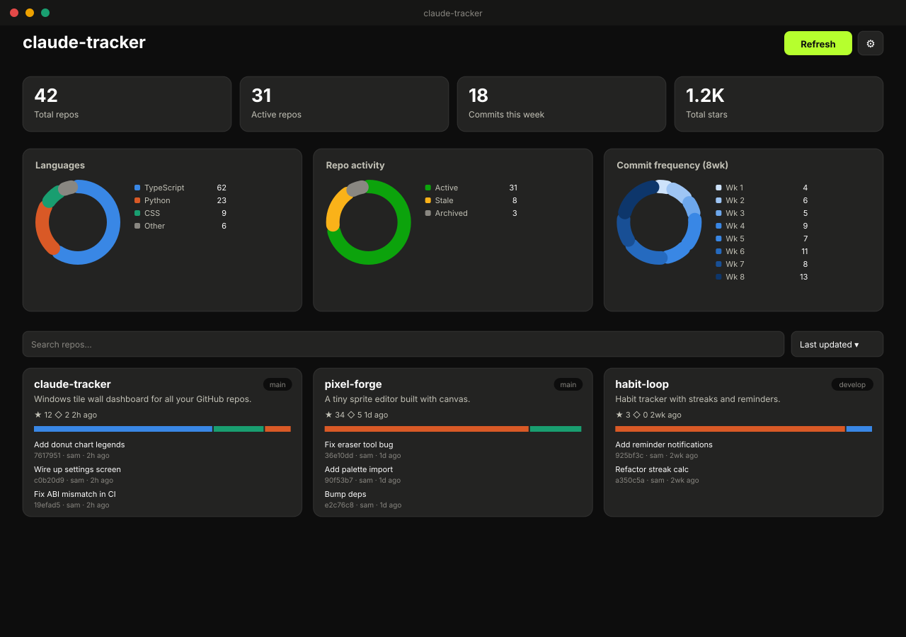

# claude-tracker

A Windows desktop app that shows a wall of tiles for every repo on your GitHub
account, so you can see at a glance where you left off on each thing you're
building — latest commits, stars, open issues, and language breakdown, plus a
dashboard with stat tiles and hollow donut charts summarizing everything at
once.

> **Preview** — this is a mockup built from the app's actual colors, layout,
> and chart geometry (not a captured screenshot). See
> [Screenshots](#screenshots) below for why, and how to get a real one.



## Features

- **Repo tile wall** — one tile per repo (name, description, primary
  language, stars, open issues, default branch, last updated, a per-tile
  language bar, and the latest 5 commits on the default branch)
- **Dashboard** — stat tiles (total repos, active repos, commits this week,
  total stars) plus three hollow, rounded-cap donut charts: language
  breakdown, repo activity (active / stale / archived), and commit frequency
  over the last 8 weeks
- **Sort & search** the wall by name, last updated, or stars
- **Auto-sync on launch**, plus a manual refresh button. Refreshing is cheap:
  it only re-fetches commits/languages for repos whose default-branch head
  actually moved since the last sync
- **Dark/light theme**, with a 6-swatch accent picker (including an electric
  lime/yellow-green option) that only affects UI chrome — chart colors stay
  on a fixed, colorblind-safe palette
- **Your GitHub token never leaves your machine in plaintext** — it's
  encrypted at rest via Electron's `safeStorage` (Windows DPAPI)

## Getting started

```bash
git clone https://github.com/BeardedTech0o/claude-tracker.git
cd claude-tracker
npm install
npm run dev
```

`npm install` triggers a `postinstall` step that rebuilds the native SQLite
module against Electron's Node ABI (`@electron/rebuild`) — this can take a
minute the first time.

Once the app is running, open **Settings** and paste in a
[GitHub personal access token](https://github.com/settings/tokens) (classic
or fine-grained, with `repo` read access) to start syncing.

### Scripts

| Command | What it does |
|---|---|
| `npm run dev` | Launch the app in development mode with hot reload |
| `npm run build` | Build the main/preload/renderer bundles |
| `npm run typecheck` | Type-check main, preload, renderer, and shared code |
| `npm test` | Run the Vitest suite (DB layer + GitHub sync diff logic) |
| `npm run dist` | Build and package a Windows installer locally |

## Downloading a build

Prebuilt Windows installers are published on the
[Releases page](https://github.com/BeardedTech0o/claude-tracker/releases).
Since it's unsigned (no code-signing certificate), Windows SmartScreen will
warn on first run — click **More info** → **Run anyway**.

## Building the installer

`npm run dist` packages a Windows NSIS installer via `electron-builder`, but
producing a real `.exe` this way currently only works **on Windows** (or
Linux with `wine` installed) — `electron-builder` needs to patch icon/version
resources into a Windows binary, which requires either the real OS or `wine`
to emulate it.

Because of that, this repo builds its releases in CI instead:
[`.github/workflows/release.yml`](.github/workflows/release.yml) runs on an
actual `windows-latest` GitHub Actions runner whenever a `vX.Y.Z` tag is
pushed — it type-checks, runs tests, builds, and publishes the installer
straight to [Releases](https://github.com/BeardedTech0o/claude-tracker/releases).

To cut a new release:

```bash
# bump "version" in package.json first, then:
git tag vX.Y.Z
git push origin vX.Y.Z
```

## Screenshots

This project was scaffolded and built in a sandboxed Linux environment with
no display server, so the running app itself has never actually been
launched or visually verified end-to-end — only typechecked, unit-tested,
and bundle-built. The image at the top of this README is a static SVG
mockup generated from the app's real CSS tokens, layout, and donut-chart
math, standing in for a genuine screenshot until someone runs it on Windows
and grabs one. If that's you — a real screenshot replacing `docs/screenshot.svg`
would be a welcome PR.

## Tech stack

Electron + React + TypeScript, bundled with `electron-vite`. Data lives in a
local SQLite database (`better-sqlite3`) in the Electron main process; the
renderer talks to it exclusively over a typed IPC bridge (`contextBridge`,
no direct Node access). GitHub API calls go through Octokit with built-in
rate-limit/retry handling. State in the renderer is managed with Zustand.

## Project structure

```
src/
  main/          # Electron main process: window, SQLite, GitHub sync, IPC handlers
  preload/        # contextBridge-only IPC surface exposed to the renderer
  renderer/       # React + TypeScript UI
  shared/         # IPC channel names & types shared between main and renderer
```
